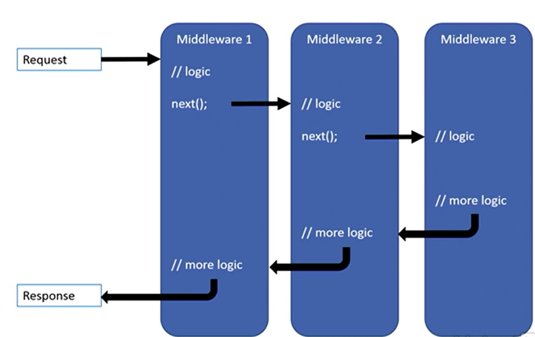
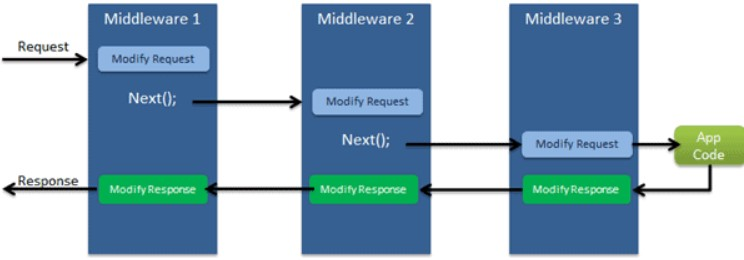

# Middleware

## What is middleware in ASP .NET Core?

A Middleware is nothing but a component (class) which is executed on every request in ASP.NET core application. 
(In classic ASP.NET, HttpHandlers and HttpModules where part of request pipeline.  Middleware is similar to 
HttpHandlers and HttpModules where both needs to be configured and executed in each request)

Typically, there will be multiple middleware in ASP.NET Core web application. It can be either framework 
provided middleware, or your own custom middleware. We can set the order of middleware execution 
in the request pipeline. Each middleware adds or modifies http request and optionally passes control to the next
middleware component. The following figure illustrates the execution of middleware components.



<br/>
<br/>



Middleware allows us to introduce additional logic before or after executing an HTTP request.

There are three approaches to creating middleware:
- With Request Delegates
- By Convention
- Factory-Based

```c#
app.UseMiddleware<EnvironmentMiddleWare>();

using System.Diagnostics;

internal class EnvironmentMiddleWare
{
	public RequestDelegate Next { get; private set; }
	public string EnvironmentName { get; private set; }

	public EnvironmentMiddleWare(RequestDelegate next, IWebHostEnvironment env)
	{
		Next = next;
		EnvironmentName = env.EnvironmentName;
	}
	public async Task Invoke(HttpContext context)
	{
		var timer = Stopwatch.StartNew();
		context.Response.Headers.Add("X-HostingEnvironmentName", new[] { EnvironmentName });

		await Next(context);

		if(context.Response.ContentType != null && context.Response.ContentType.Contains("application/json"))
		{
			await context.Response.WriteAsync($"<p>From {EnvironmentName} in {timer.ElapsedMilliseconds} ms</p>");
		}
	}
}
```


```
app.Map("/stuff", a => a.Run(async context =>{
	context.Response.ContentType = "Text/html";
	await context.Response.WriteAsync("Hello World in Stuff!");
}));
```
